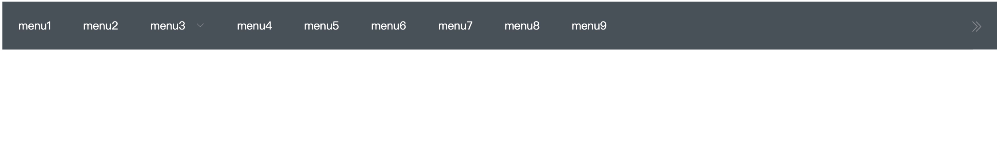

# ml-vue-components
Vue组件库，收集一些自己写的轮子

## ml-horizontal-menu 自适应横向菜单

详情见 👉🏻[文档](./component/ml-horizontal-menu/README.md)

### demo

## vue-tab-component 无限滚动tab

详情见 👉🏻[文档](https://github.com/qq240814476/vue-tab-component)

## ml-vue-drag-tree vue 拖拽树🌲

详情见 👉🏻[文档](https://github.com/qq240814476/ml-vue-drag-tree)
